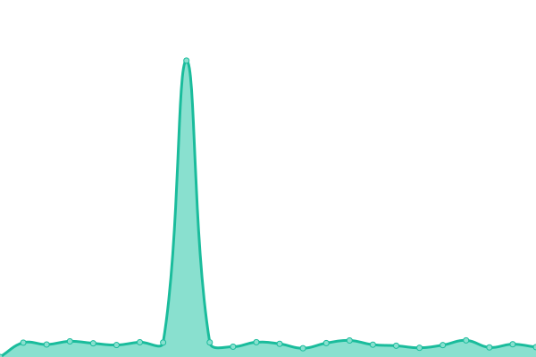

# [📈 Live Status](https://Subaru-SciOp.github.io/subaru-sciop-status): <!--live status--> **🟩 All systems operational**

This repository contains the open-source uptime monitor and status page for [Science Operation Division, Subaru Telescope](https://Subaru-SciOp.github.io/subaru-sciop-status), powered by [Upptime](https://github.com/upptime/upptime).

With [Upptime](https://upptime.js.org), you can get your own unlimited and free uptime monitor and status page, powered entirely by a GitHub repository. We use [Issues](https://github.com/Subaru-SciOp/subaru-sciop-status/issues) as incident reports, [Actions](https://github.com/Subaru-SciOp/subaru-sciop-status/actions) as uptime monitors, and [Pages](https://Subaru-SciOp.github.io/subaru-sciop-status) for the status page.

<!--start: status pages-->
<!-- This summary is generated by Upptime (https://github.com/upptime/upptime) -->
<!-- Do not edit this manually, your changes will be overwritten -->
<!-- prettier-ignore -->
| URL | Status | History | Response Time | Uptime |
| --- | ------ | ------- | ------------- | ------ |
|  [PSF Spectral Simulator](https://pfs-etc.naoj.hawaii.edu/etc/app) | 🟩 Up | [psf-spectral-simulator.yml](https://github.com/Subaru-SciOp/subaru-sciop-status/commits/HEAD/history/psf-spectral-simulator.yml) | 

 864ms
     
 | 

<a href="https://Subaru-SciOp.github.io/subaru-sciop-status/history/psf-spectral-simulator">84.36%</a>
    

|  [PFS Target Uploader](https://pfs-etc.naoj.hawaii.edu/uploader/) | 🟩 Up | [pfs-target-uploader.yml](https://github.com/Subaru-SciOp/subaru-sciop-status/commits/HEAD/history/pfs-target-uploader.yml) | 

 470ms
     
 | 

<a href="https://Subaru-SciOp.github.io/subaru-sciop-status/history/pfs-target-uploader">84.44%</a>
    

|  [PFS Flux Standard Star Lookup](https://pfs-etc.naoj.hawaii.edu/fluxstd-lookup/app) | 🟩 Up | [pfs-flux-standard-star-lookup.yml](https://github.com/Subaru-SciOp/subaru-sciop-status/commits/HEAD/history/pfs-flux-standard-star-lookup.yml) | 

 188ms
     
 | 

<a href="https://Subaru-SciOp.github.io/subaru-sciop-status/history/pfs-flux-standard-star-lookup">84.52%</a>
    

|  [PSF Target Database Docs](https://pfs-etc.naoj.hawaii.edu/targetdb/) | 🟩 Up | [psf-target-database-docs.yml](https://github.com/Subaru-SciOp/subaru-sciop-status/commits/HEAD/history/psf-target-database-docs.yml) | 

 242ms
     
 | 

<a href="https://Subaru-SciOp.github.io/subaru-sciop-status/history/psf-target-database-docs">84.59%</a>
    

|  [PFS Jira](https://pfs-jira.naoj.org/jira/) | 🟩 Up | [pfs-jira.yml](https://github.com/Subaru-SciOp/subaru-sciop-status/commits/HEAD/history/pfs-jira.yml) | 

 2128ms
     
 | 

<a href="https://Subaru-SciOp.github.io/subaru-sciop-status/history/pfs-jira">79.99%</a>
    

<!--end: status pages-->

[**Visit our status website →**](https://Subaru-SciOp.github.io/subaru-sciop-status)

## 📄 License

- Powered by: [Upptime](https://github.com/upptime/upptime)
- Code: [MIT](./LICENSE) © [Anand Chowdhary](https://anandchowdhary.com), supported by [Pabio](https://pabio.com)
- Data in the `./history` directory: [Open Database License](https://opendatacommons.org/licenses/odbl/1-0/)
